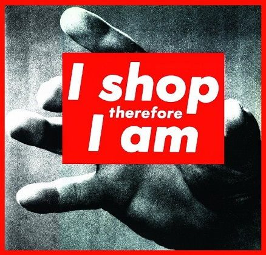

Material: Art Terms
===================

Conceptual Art
--------------

<https://www.theartstory.org/movement/conceptual-art/>

-   ideas are prized over formal or visual components of art works
-   mix of tendencies and not super cohesive
-   mid 60s to mid 70s they completely rejected standard ideas of art
-   articulation of an idea suffices as a work of art
-   it was weird to people at first, but like abstract expressionism it
    expanded what art was
-   they abandoned beauty, rarity, skill as measures of art
-   influenced by Minimalism, readymades
-   deeply indebted and based on readymades by Marcel Duchamp --
    idea-based art
-   Fluxus (inspiration by everyday things and embrace of change) and
    Minimalism (non-traditional size, materials, production) inspired it
-   defiance of the art market where personalities and masterpieces were
    being promoted
-   1967 saw the "manifesto" by Sol LeWitt: *What the work of art looks
    like isn't too important. It has to look like something if it has
    physical form. No matter what form it may finally have it must begin
    with an idea. It is the process of conception and realization with
    which the artist is concerned.*
-   this went against what art was defined as at the time
-   some took it so far that they didn't produce physical art at all and
    just left it at the ideas stage
-   a good bit of this art was political in nature: commenting on the
    pharmaceutical industry and AIDS epidemic, political oppression
-   conceptualism can have a variety of different forms
-   Lawrence Weiner in "Declaration of Intent": *Art that imposes
    conditions - human or otherwise - on the receiver for its
    appreciation in my eyes constitutes aesthetic fascism*

Postmodernism
-------------

<https://www.tate.org.uk/art/art-terms/p/postmodernism>

-   reaction against modernism and its dominance
-   associated with skepticism, irony, critique of universal truths and
    objective reality
-   first used in 1970
-   it is hard to define because it does not follow some kind of theory
-   modernism was based on idealism and utopian visions on human life --
    universal principles and truths (religion, science) could ultimately
    explain reality
-   thus post-modernism was based in skepticism, suspicion of reason;
    challenged the idea of universal truths -- individual experience is
    more concrete than abstract principles
-   **postmodernism often embraced complex and contradictory layers of
    meaning**
-   anti-authoritarian, it refused a single style or definition
-   it broke barriers between high culture and everyday culture,
    introduced a sense of anything goes
-   it consciously borrows from different styles and styles from the
    past and comments on that too

Feminist Art
------------

<https://www.moma.org/collection/terms/168>

-   art which seeks to challenge the dominance of men in art and society
-   gain recognition, equality for woman artists, question assumptions
    about womanhood
-   beginning in the 1960s painting, performance art, and "women's
    crafts" were made that aimed to end sexism and oppression
-   exposed femininity as masquerade -- set of poses women adopt to
    conform to society
-   younger artists also incorporate intersecting concerns about race,
    class, forms of privilege, gender identity and fluidity
-   this art style continues to evolve

<https://www.theartstory.org/movement/feminist-art/>

-   emerged in the 1960s amidst general civil rights, anti-war, and
    queer rights movements
-   wanted to re-write falsely male-dominated art history
-   also wanted to intervene in current culture and transform
    stereotypes
-   created previously non-existent opportunities for women and minority
    artists
-   paved the way for identity art of the 1980s
-   wanted dialogue through inclusion of womens perspective
-   art is not just for aesthetics, but also to incite, to bring change
    towards equality
-   creation of alternate venues for women in the arts made exhibitions
    in a prohibitive environment possible
-   also worked to change existing policies to promote women
-   often used "female materials" like textiles or previously seldom
    used media like performance and video -- lacked male-dominated
    history and expanded the definition of fine art

Photomontage
------------

<https://www.tate.org.uk/art/art-terms/p/photomontage>

-   collage constructed from photographs
-   often used to express poltical dissent
-   first used by dadaists in 1915 in protest against WWI
-   then used by surrealists to do their thing

<https://www.theartstory.org/definition/photomontage/history-and-concepts/>

-   was controversial at first because it misrepresented reality but
    people wanted to create things that rivaled fine art

Material: Artists
=================

Barbara Kruger
--------------

<https://www.theartstory.org/artist/kruger-barbara/>

-   designer, graphic artist, photographer
-   Born: January 26, 1945 - New Jersey
-   best known for silkscreen prints that place a concise caption across
    a found photograph
-   Reaganomics covered with satire in the 80s
-   expanded to installations, video, audio works
-   rooted in social, cultural, political critique
-   postmodern feminist art, conceptual art, photomontage
-   images with short captions allow direct communication with the
    viewer
-   short statements that critique social, societal, political, gender,
    culture...
-   catchphrases and slick graphical facade
-   always contemporary, she sells ideas instead of a product
-   appropriates images and adds confrontational phrases
-   palette of red, white, and black leaves an impression
-   child of legal secretary, father chemical technician
-   took art classes in Uni and moved to NYC to take more art classes
-   started out with architectural photography, painting, craft, erotic
    imagery
-   worked for publications in NYC, lead designer at 22
-   was first exhibited in 1973
-   took up writing and poetry in the 70s, went back to photography and
    words
-   was bases of her later conceptual work
-   became more ambitious and critical in her use of text and images,
    started using found images, generally from mass media publications
-   style influence by Russian Constructivists, *Alexander Rodchenko*

Quotes

-   Direct address has been a consistent tactic in my work, regardless
    of the medium that I'm working in.
-   I try to deal with the complexities of power and social life, but as
    far as the visual presentation goes I purposely avoid a high degree
    of difficulty. I want people to be drawn into the work.
-   Do you know why language manifests itself the way it does in my
    work? It's because I understand short attention spans.
-   I basically wasn't cut out for design work because I had difficulty
    in supplying someone else's image of perfection
-   I think that art is still a site for resistance ... I'm trying to be
    affective, to suggest changes, and to resist what I feel are the
    tyrannies of social life on a certain level.

### Artworks

#### Untitled (Your Body is a Battleground) (1989)

pic:
<https://www.thebroad.org/art/barbara-kruger/untitled-your-body-battleground>

-   protests against antiabortion laws chipping away at 1973 Roe vs.
    Wade
-   both art and protest

<https://www.theartstory.org/artist/kruger-barbara/artworks/#nav>

-   1989 reproductive rights protest *March for Women's Lives* in D.C.
-   signature color palette; short, declarative, critical message
-   split colors with negative -- struggle, maybe inner struggle
-   very direct in message and face staring at you

\newpage
#### Untitled (I Shop Therefore I am) (1987)

pic: <https://publicdelivery.org/barbara-kruger-i-shop/>

-   conceptual work of art
-   very small *therefore* -- isn't that obvious and message is still
    sound
-   critique of consumerism
-   spin on *I think therefore I am* - Rene Descartes
-   materialistic items replace self-worth -- shopping defines existence
-   focus on having rather than being
-   *identity construction through consumption*
-   feminist angle: male-looking hand holds up this sign as critique of
    images of women -- women being defined through their appearance
-   work can be interpreted from multiple angles

\newpage
#### It's all about me, I mean you, I mean me (2010)

pic:
<https://www.wmagazine.com/gallery/kim-kardashian-queen-of-reality-tv-ss/>

<https://www.theartstory.org/artist/kruger-barbara/artworks/#nav>

-   2010, cover of *W* magazine
-   featuring Kim Kardashian
-   Futura font, red background
-   caption can be critique of the image or exclamation by the subject

\newpage
#### Rage + Women = Power (1992)

pic:
<https://www.moma.org/collection/works/73568?sov_referrer=art_term&art_term_id=168>

-   cover of *Ms.* magazine
-   Kruger was already known at that point
-   she investigated the ways in which ideological messages infiltrate
    everyday life
-   a return to her roots

\newpage
Mary Beth Edelson
-----------------

<https://www.moma.org/artists/34727>

<https://en.wikipedia.org/wiki/Mary_Beth_Edelson>

-   born 1933 as Mary Elizabeth Johnson
-   at 13 she organized a support group for people who experienced
    trauma
-   started taking art lessons at this age at the Art Institute of
    Chicago
-   first generation feminist artist
-   studied at the Art Institute of Chicago
-   got a Master of Fine Arts degree
-   taught art at college level
-   in 1970s she focused on how women are portrayed in art
-   1970s: representations of goddesses -- contrast to patriarchal views
    of women
-   she wanted to increase the number of exhibited female artists
-   also active in the Civil Right movement
-   established the first conference for women in the visual arts in
    1968
-   leader of the Committee on Diversity and Inclusion and the Women's
    Action Coalition from 1992 to 1994

### Artworks

#### Some Living American Women Artists / Last Supper (1972)

pic:
<https://www.moma.org/collection/works/117141?sov_referrer=art_term&art_term_id=168>

-   poster mock-up referencing Leonrado da Vinci's *The Last Supper*
-   Jesus and his disciples have their faces covered by Edelson's
    friends or heroes
-   she wanted to present the faces of women artists that were seldom
    seen in 1972 while spoofing male exclusivity of patriarchy
-   Georgia O'Keeffe is Jesus, everyone else is randomly placed
-   Judas is not one of her peers

<https://en.wikipedia.org/wiki/Mary_Beth_Edelson>

-   82 women in the image

\newpage
Guerilla Girls
--------------

<https://www.tate.org.uk/art/artworks/guerrilla-girls-the-advantages-of-being-a-woman-artist-p78796>

-   inception in 1984 in response to a survey at the MOMA that showed
    that of 169 artists less than 10% were women
-   work to expose sexual and racial discrimination in the art world,
    particularly New York
-   members wear gorilla masks in public to protect their identities and
    use pseudonyms
-   in the 1980s when artwork prices rose steeply, female presence in
    exhibitions diminished dramatically
-   call themselves *conscience of the art world*
-   target everyone they feel causes or is complicit in the exclusion of
    women and non-white artists
-   similar vein to Barbara Kruger who appropriated the visual language
    of advertising
-   do lots of work in NYC critical of the museums there

### Artworks

#### The Advantages Of Being A Woman Artist (1988)

pic:
<https://www.tate.org.uk/art/artworks/guerrilla-girls-the-advantages-of-being-a-woman-artist-p78796>

-   30 images in portfolio titled *Guerilla Girls Talk Back*
-   group of anonymous American female artists
-   lists 13 ironic points about being a female artist

\newpage
#### Do Women Have To Be Naked To Get Into the Met. Museum? (1989)

pic:
<https://www.tate.org.uk/art/artworks/guerrilla-girls-do-women-have-to-be-naked-to-get-into-the-met-museum-p78793>

-   from same portfolio as the previous poster
-   reclinig naked women that wears the typical gorilla mask
-   image is based on *La Grande Odalisque* (1814) by
    Jean-Auguste-Dominique Ingres
-   tried to get this onto advertising space but were rejected based on
    the image

\newpage
Ridykeulous with Nicole Eisenman, A.L. Steiner
----------------------------------------------

<https://www.moma.org/collection/works/284636?sov_referrer=art_term&art_term_id=168>

-   curatorial initiative formed by the Nicole Eisenman, A.L. Steiner in
    2005
-   has the goal to encourage the exhibition of queer and feminist art
-   uses humor to critique the art world and culture in general

### Artworks

#### The Advantages of Being a Lesbian Woman Artist (2006)

pic:
<https://www.moma.org/collection/works/284636?sov_referrer=art_term&art_term_id=168>

\newpage

